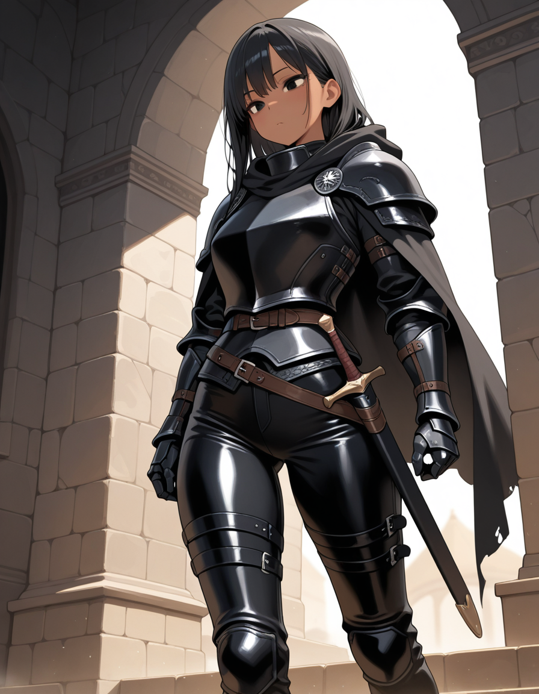
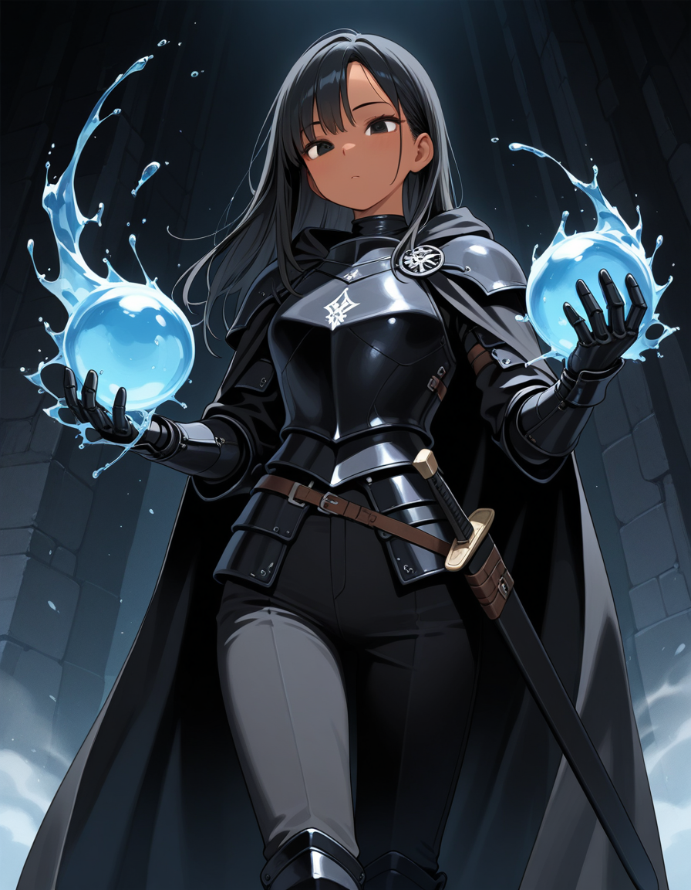

<InfoBox
  label="Möhnət Ikaru"
  :content="{
    '': [
      { key: 'Name', value: 'Möhnət Ikaru' },
      { key: 'Aliases', value: [ 'Mona', 'Queen Möhnət' ] },
      { key: 'Kingdom of Origin', value: 'Ikarye', valueLink: 'ikarye' },
      {
        key: 'Relatives',
        value: [ 'Qatil Ikaru (brother)', 'Sirus Ikaru (father)', 'Zərərli Ikaru (mother)' ],
        valueLink: { 'Qatil Ikaru (brother)': 'qatil-ikaru' },
      },
    ],
    'Combat': [
      { key: 'Magic', keyLink: 'magic', value: 'Water   Ice' },
      { key: 'Weapon of Choice', value: 'None' },
    ],
    'Appearances': [
      { key: 'First appearance', value: 'The Prince\'s Truth', valueLink: 'the-prince\'s-truth' },
      { key: 'Last appearance', value: 'Heyvan', valueLink: 'heyvan-(book)' },
    ],
    'Physical description': [
      { key: 'Species', keyLink: 'species', value: 'Caster' },
      { key: 'Gender', value: 'Female' },
    ],
    'Other': [
      { key: 'Theme', sc: true, value: '455566374' },
    ],
  }"
>
  
</InfoBox>

<!-- A quote is optional for an entry -->
<!-- To include a quote on the entry, delete the surrounding comment -->
<!--
  > [quote]
  >
  > ― [speaker]
-->

<!-- Introduce the character here -->
**Möhnət Ikaru** is the twin sister of [Qatil Ikaru](/qatil-ikaru), and is the crowned princess of [Ikarye](/ikarye). As a child Möhnət was revered by her people as a magic prodigy having been taught by her mother Zerali Ikaru one of the greatets casters in all of Cradia. Much like her mother Möhnət chose to specialize in water magic, which she would eagerly attempt to flaunt off to her brother Qatil.

While growing up Möhnət was always in her brother's shadow, no matter how she excelled in magic or in ettiquet she was always second to Qatil, even when it came to her parents love and attention she was disregarded. The only love she ever knew growing up was from that of her brother, because of this Qatil meant the world to Möhnət, because as far as she was concerned Qatil was all she had.

<TableOfContents
  :contents="[
    { text: 'Backstory' },
    { text: 'Appearance' },
    { text: 'Personality' },
    { text: 'Culture' },
    { text: 'Combat_and_magic' },
    { text: 'Trivia' }
  ]"
/>

## Backstory

<!-- Put the character's backstory here -->
Möhnət like her brother Qatil, grew up within the confines of the Ikarye castle. Möhnət tended to spend all her time with Qatil as she had no one else in her life that would give her the time of day.

One day when walking through the royal garden Möhnət convinces Qatil to skip a lesson he had with their father to join her for a magic lesson with their mother. Möhnət was eager to share the wonders of magic with Qatil, but soon their father had figured out what was happening and put an end to it immediately. As a result Möhnət's father Sirus Ikaru sent her off the a nearby military outpost at the age of 6.

Now separated from her brother Möhnət had no choice but to continue focusing on her magic and combat, she was no longer within the secure walls of a kingdom and needed to be prepared, she knew if she wasn't she'd never see her brother again.

## Appearance

<!-- Describe the character's appearance here -->
In part one of [The Prince's Truth](/the-prince's-truth) Möhnət looks nearly indetical to her twin brother Qatil. She had short black hair, tan skin, dark black iris's, and the same chubby like features. Möhnət wore small dark colored dresses as she was drawn to less vibrant colors unlike most young girls, this fassion choice would soon change when she was sent off to a military outpost where she was forced to adorn chain mail as regular armor was to big for her along with what she would describe as uncomfortable peasant wear. 

## Personality

<!-- Describe the character's personlity here -->
Möhnət Ikaru has been an optimist since birth and has always found it easy to find joy in many things. In the darkest of times she always found a way to look on the bright side, yet even she has her fragile moments and falls into despair. Möhnət is protective of those close to her, almost acting as a motherly figure. Möhnət has also been seen being very cocky and full of herself, most likely because of her advanced combat and magic abilities, this can cause her to be careless and underestimate people. Unlike her brother Qatil, Möhnət appears to be a sceptic, always asking questions and never being satisfied with the answers she receives.

<ContentFigure>
  
  <template #caption>Möhnət using her <a title="Core Magic" href="/magic#Core_magic">water magic</a></template>
</ContentFigure>

## Combat and magic

<!-- Describe the character's combat and magic skills here -->
[combat & magic]

## Trivia

<!-- Add some character trivia here -->
[trivia]