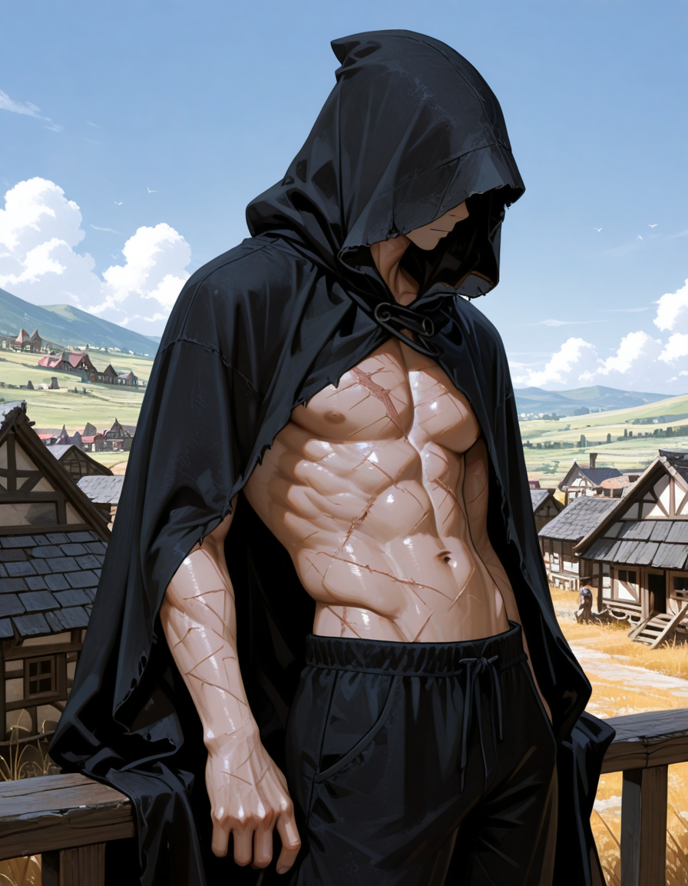
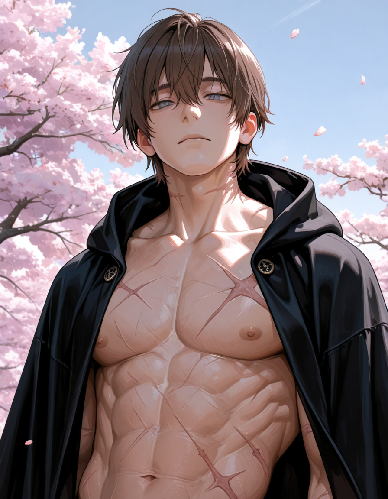

<InfoBox
  label="Order"
  :content="{
    '': [
      { key: 'Name', value: 'Nordac' },
      { key: 'Aliases', value: [ 'Order', 'God of Blood' ] },
      { key: 'Kingdom of Origin', value: 'None', },
      { key: 'Relatives', value: 'None' },
    ],
    'Combat': [
      { key: 'Magic', keyLink: 'magic', value: 'Blood' },
      { key: 'Weapon of Choice', value: 'Longsword' },
    ],
    'Appearances': [
      { key: 'First appearance', value: 'The Prince\'s Truth', valueLink: 'the-prince\'s-truth' },
      { key: 'Last appearance', value: 'The Prince\'s Truth', valueLink: 'the-prince\'s-truth' },
    ],
    'Physical description': [
      { key: 'Species', keyLink: 'species', value: 'Demigod' },
      { key: 'Gender', value: 'Male' },
    ],
    'Other': [
      { key: 'Theme', sc: true, value: '1855535337' },
    ],
  }"
>
  
</InfoBox>

> I'm gonna kill you now
>
> ― Order

**Order** is the main antaganist of [The Prince's Truth](/the-prince's-truth) and is also an antaganist in [Heyvan](/heyvan-(book)). He was the first being to ever be created and created everything in the universe that existed pre Universal Destruction. The only things he did not create was anything derived of chaos. This includes chaos itself and [Qatil Ikaru](/qatil-ikaru). Order is an enemy of [Kira Amaikoru](/kira-amaikoru) and seeks to bring her to justice and restore order to the universe.

<TableOfContents
  :contents="[
    { text: 'Backstory' },
    { text: 'Appearance' },
    { text: 'Personality' },
    {
      text: 'Combat_and_magic',
      children: [
        { text: 'Blood_magic' },
      ],
    },
    { text: 'Trivia' }
  ]"
/>

## Backstory

Order's backstory is told through [The Birth of Order](https://docs.google.com/document/d/156tEg_gCU1lIk8yqMwPWvJ8fE2a_Ql3_OI6n4iYDIOs/edit?usp=sharing), a story in an old religious book centered around worshipping Order. It describes Order being created by a big bang that was the result of chaos becoming infinitely dense. The chaos was then destroyed and all that existed in the universe was Order. The story then describes Order creating the world and everything on it, such as the humans, animals, and plants. Order created life and the world because he wanted to ascend someone to godhood.

After a long period of time, Order decided to ascend Kira Amaikoru, a girl living in the kingdom [Canavar](/canavar) at the time. After she was ascended, Order gave her half of his power. Kira was greedy and wanted more of his power, so she took it all and sent him down to Cradia where he lost his godhood and became a [demigod](/species#Demigods).

Since then, Order has been preparing to stop Kira and return order to the universe. He's done so by killing Kira worshippers and slowing the spread of her influence around Cradia. After Order discovered that Qatil was working with Kira in The Prince's Truth, he set out kill him next.

<ContentFigure>
  
  <template #caption>Order with his hood down</template>
</ContentFigure>

## Appearance

Order is a tall male with light skin, amber eyes, and black hair. He isn't super muscular and is just slightly toned, however, this doesn't seem to affect his power. Order dresses in dark clothing and doesn't tend to wear shirts, preferring to have his upper body exposed. Order will sometimes wear cloaks to remain conspicuous. Additionally, he doesn't prefer wearing armor or heavy clothing items as he idolizes agility over endurance.

## Personality

It is hard to tell what kind of personality Order has because he is very monotone. He rarley shows emotion and it is most likely because he doesn't deem it necessary. However, because he was once a God, Order is very wise. He is very good at picking up on his enemies' weaknesses and knows when to quit if he's lost. He prefers to get things over with and doesn't do something he believes is a waste of his time. He likes to get straight to the point and doesn't hold back.

Order doesn't seem to have any empathy for the people of Cradia, his intentions to them being more indifferent. He doesn't have any issues killing and destroying if it means achieving what he deems necessary, however, he won't kill anyone if it doesn't serve a purpose. Some believe Order has a huge ego, yet Order doesn't believe highly of himself, he knows he's better than others because of what he's able to do.

Order is driven by what he believes should be done to save the universe, which is stopping [Kira Amaikoru](/kira-amaikoru) and putting an end to chaos. He doesn't let anyone get in his way or try to stop him, and he will stop at nothing to achieve his goal.

## Combat and magic

Order is very skilled in any type of combat, whether it be close combat, ranged combat, or comabt via [magic](/magic). Order, being very wise, is able to learn his enemies fighting patterns and weaknesses very easily, using it to gain the upper hand in any battle. Additionally, Order is able to use any weapon known to man with unimaginable skill, including his fists, yet he prefers to use longswords due to their elegance and handling. Order never chooses to hold back and always prefers to get things done quick and fast.

### Blood magic

Order also uses [blood magic](/magic#Divine_magic) in combat, being able to move his own blood and form it into different shapes. When beginning a fight, Order cuts his wrists with a knife he always carries in order to have quick access to his blood. Order can use to his blood to form his own weapons, create shields, move objects that are stained with his blood, and much more.

Order does not prefer to create weapons out of his blood because they shatter easily yet, he will choose to do it if he has no other choice. Order may also use his blood to steal weapons from his enemies if his blood gets stained on it. Order can also use his blood to create quick shield, which, although they shatter easily, can be used to block a quick attack. When fighting with his blood, Order's only limits are his imagination. He can create daggers with it that can be flown towards his enemies, can expand it rapdily, causing an explosion of blood, can create massive fists with it, and can even fly by moving the blood in his body.

Unfortunately, Order does not regenerate his blood faster than a normal person, meaning he has to use it sparingly in fights. However, he can send his blood back to his body, allowing him to prevent his own blood loss. Order can also close his wounds with his blood, yet it can lead to prominent scars that are left on his body. Additionally, Order can feel with his blood, allowing him to sense movement with it.

## Trivia

* Order is just his title and his real name, Nordac, isn't commonly known.
* Order chose to practice [blood magic](/magic#Divine_magic) after being banished to Cradia because it makes him stronger the more he is hurt.