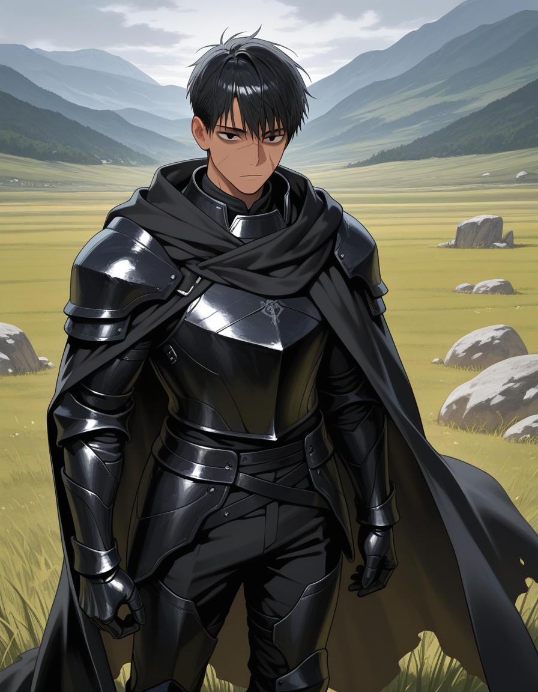

<InfoBox
  label="Qatil Ikaru"
  :content="{
    '': [
      { key: 'Name', value: 'Qatil Ikaru' },
      { key: 'Aliases', value: 'None' },
      { key: 'Kingdom of Origin', value: 'Ikarye', valueLink: 'ikarye' },
      { key: 'Relatives', value: 'Möhnət Ikaru (sister)   Sirus Ikaru (father)   Zərərli Ikaru (mother)' },
    ],
    'Combat': [
      { key: 'Magic', keyLink: 'magic', value: 'Terra   Fire' },
      { key: 'Weapon of Choice', value: 'Scythe' },
    ],
    'Appearances': [
      { key: 'First appearance', value: 'The Prince\'s Truth', valueLink: 'the-prince\'s-truth' },
      { key: 'Last appearance', value: 'The Prince\'s Truth', valueLink: 'the-prince\'s-truth' },
    ],
    'Physical description': [
      { key: 'Species', keyLink: 'species', value: 'Caster' },
      { key: 'Gender', value: 'Male' },
    ],
    'Other': [
      { key: 'Theme', sc: true, value: '305163327' },
    ],
  }"
>
  
</InfoBox>

> You are strong Qatil, yet you are blind to many truths. But know this, my dear, no matter who shuns you or confronts you for what you may destroy, I will always know you were just trying to help.
>
> ― [Kira Amaikoru](/kira-amaikoru)

**Qatil Ikaru**, the primary protagonist of [The Prince's Truth](/the-prince's-truth), was the crowned prince of [Ikarye](/ikarye), one of the six kingdoms that populated the continent of Cradia. When Qatil was eight years old, he was visited by the Goddess [Kira Amaikoru](/kira-amaikoru), who led Qatil on the path of destruction.

While Qatil was growing up, he was trained by his father Sirus Ikaru to wield a sythe, and by his mother Zərərli Ikaru to cast [terra magic](/magic#core-magic). Qatil was later gifted [fire magic](/magic#divine-magic) by Kira during the Pre Universal Descrution fall of [Canavar](/canavar).

## Backstory

Qatil Ikaru grew up confined within the castle walls of [Ikarye](/ikarye), longing for the day he got to leave and discover the world. During his time in the kingdom, he only had his twin sister Möhnət Ikaru to keep him company.

Unlike his sister, who practiced [magic](/magic) growing up, Qatil was taught how to wield a sythe in battle by his father Sirus Ikaru. Interactions with his father were brief but to Qatil's description, unnecessarily cruel. These abusive moments for Qatil were only alleviated by his moments with his sister whom he came to treasure greatly.

Qatil's relationship with his mother was much better than his relationship with his father. Zərərli Ikaru always doted on Qatil for the littlest things, always regarding him with the highest of expectations. Although for Qatil, his mother's behavior was always unsettling for him, and he tended to avoid her growing up.

## Appearance

In part one of [The Prince's Truth](/the-prince's-truth), the story begins with Qatil being six years old. He had a short stature, a roundish and chubby-like face, tan skin, short, wavy black hair, and pure black irises. During his time growing up, Qatil only adorned the prince's royal garbs. This changed when Qatil turned fourteen and left [Ikarye](/ikarye), now dressed in an armored version of his usual royal garbs.

In part two, Qatil's appearance changes dramatically. Qatil has grown up and is much taller with much more defined features and longer hair. He also gained a much more toned body after being outside of his home kingdom for years and participating in the Cradia World War. Further into his journey, Qatil changed his outfit so that he would not be noticed as a royal, replacing the pieces of clothing that were royal garbs with cloth and what would be considered peasant clothing with colors varying from gray, brown, and a faded shade of red.

In part three, Qatil grows in height slightly and adornes much longer hair and a beefier body. Parts of his clothes now had scorch marks on them after using [fire magic](/magic#divine-magic) for the first time in [Canavar](/canavar). After Qatil leaves Canavar, he eventually grows his hair out styling it into a long wolf cut and now has a prominent scar across his left cheek.

## Personality

Qatil Ikaru has been a pessimist at birth and always found it difficult to find joy in many things. The only people that seem to make Qatil happy are his friends. Being raised from birth in the pampering confines of a royal castle, he was a spoiled child, always yearning for more and more in his life. Although, he was always humbeled by his father as he grew up. In part one of [The Prince's Truth](/the-prince's-truth), it is readily apparent that Qatil is very gullible. This is especially shown in his first interaction with Kira, showing immediate trust to a random lady he met in the woods.

It is also shown throughout the events of part two that Qatil has an eating dissorder and doesn't like to eat much. His lack of appetite is due to his immense pessimism; he finds no need in 'overeating' even though he's clearly undereating. While Qatil is usually lenient with his friends' antics, he can quickly become stern with them when the moment calls for it.

Overall, throughout the first three parts of The Prince's Truth, Qatil is a playful yet depressive character that tends to have a bleak outlook on life. However, he is easily pulled into the graces of joy via people close to him. Above all, if pushed close enough to the edge, Qatil has been shown to snap and disregard the safety and well being of anyone around him all just to achieve a goal of revenge.

## Combat & Magic

Qatil was one of the greatest Cradian warriors to ever live, yet he struggled to combine his physical fighting techniques with his magic ones. Qatil's hand-to-hand combat followed a style derived from mixed martial arts, but Qatil prefered to use weapons when available. His weapon of choice and the one he was the most skilled in using was the scythe. While training to wield proper weapons with his father, Qatil showed great promise while wielding a scythe, cutting clean through a stone dummy with one made of iron. This was due to Qatil's abnormal strength, which only arose as Qatil was destroying [Canavar](/canavar). This strength was also prominently shown in Qatil's fight with [Order](/order).

### Terra Magic

[Terra magic](/magic#core-magic) was the first type of magic taught to Qatil. Even from a young age Qatil, showed a vast amount of skill for the art of [magic](/magic). With terra magic being one of the more imaginative forms of magic, Qatil used it to its full capabilities, forming different sizes and shapes of pillars, cubes, balls, stairs, and spikes for a variety of uses. Qatil usually used terra magic for combat and transportation. While it is easy for any terra magic user to cast a giant rock cube at someone, Qatil liked to take it to another step by casting said cube and splitting it into thousands of tiny spikes while it flew through the air, not only causing an unexpected surprise for his enemies but also increasing his area of the attack as he gave each spike it's own direction. As for transportation, Qatil has been seen launching himself and allies with pillars that shoot out from beneath their feet, as well as form makeshift stairs at the side of stone walls.

### Fire Magic

[Fire magic](/magic#divine-magic) was the second type of magic Qatil ever casted. Qatil has been the only Cradian ever to cast fire magic, and it has been considered impossible to cast throughout Cradia. But with the divine intervention of [Kira Amaikoru](/kira-amaikoru), Qatil gained the ability to cast this allusive and destructive magic. Qatil used rage to fuel his fire magic. Due to such rage, he used the magic irrationally, having no form or technique when using it. The way he used the magic was always described as massive bursts and occasionally used to jet Qatil into the air.

## Trivia

* Qatil's first name, chosen by his father, means killer.
* Qatil is very bad at getting signals from those that have feelings for him.
* Qatil is the physical embodiment of Chaos.