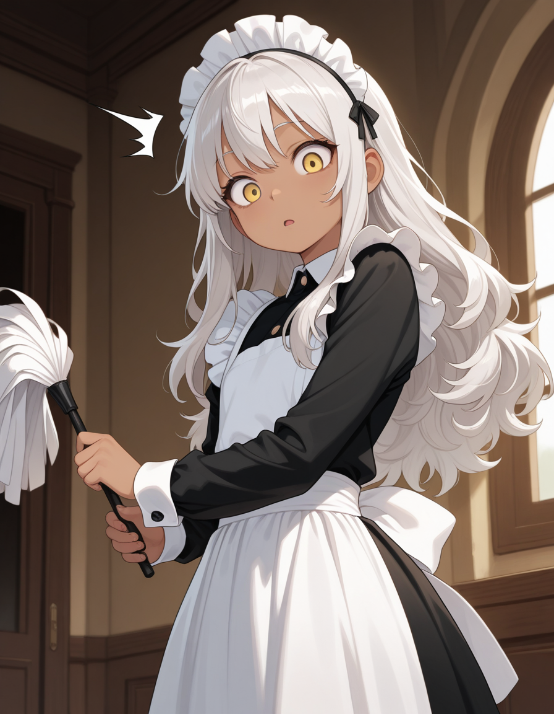

<InfoBox
  label="Ümid"
  :content="{
    '': [
      { key: 'Name', value: 'Ümid' },
      { key: 'Aliases', value: 'None' },
      { key: 'Kingdom of Origin', value: 'Ikarye', valueLink: 'ikarye' },
      { key: 'Relatives', value: 'None' },
    ],
    'Combat': [
      { key: 'Magic', keyLink: 'magic', value: 'Plant   Healing' },
      { key: 'Weapon of Choice', value: 'None' },
    ],
    'Appearances': [
      { key: 'First appearance', value: 'The Prince\'s Truth', valueLink: 'the-prince\'s-truth' },
      { key: 'Last appearance', value: 'Heyvan', valueLink: 'heyvan-(book)' },
    ],
    'Physical description': [
      { key: 'Species', keyLink: 'species', value: 'Caster' },
      { key: 'Gender', value: 'Female' },
    ],
  }"
>
  
</InfoBox>

> "Life is beautiful. Don't you agree?"
>
> ― Ümid

**Ümid** is first introduced in part 1 of [The Prince's Truth](/the-prince's-truth) as one of the many maids in the [Ikarye](/ikarye) castle. Later, she takes on a much more prominent role in [Qatil's](/qatil-ikaru) story as a very close friend who he teaches magic to.

In future parts of her story, Ümid appears to be more ignorant than most, not knowing the simplest of customs, as well as being exhausted easily as she travels with Qatil and his other friends. Depsite this, Ümid has a remarkable aptitude for [magic](/magic), learning it very quickly at a young age.

## Backstory

Ümid's story begins within the confines of [Ikarye](/ikarye). She was born into a noble family though her parents identities are not mentioned as Ümid does not remember them. It is said that her parents left her at the castle of Ikarye after they were required to join the Cradian war, they never returned. Because of this Ümid nor anyone know's her family name so she is simply known as Ümid.

She was thus raised in the castle of Ikarye and made into one of it's many maids. Though even at this young age she seemed to have an odd facination with magic, she was particularly drawn to the queen of Ikarye Zerali Ikaru, causing her to attempt to sneak into her study which caused her encounter with [Qatil Ikaru](/qatil-ikaru)

<ContentFigure>
  
  <template #caption>Ümid outside of <a title="Ikarye" href="/ikarye">Ikarye</a></template>
</ContentFigure>

## Appearance

She has luscious, wavy silver hair that reaches the middle of her back, yellow eyes, and porceline skin.

In part 1 she adorns a maid dress, being the usual black gown accented with white ruffles. Near the end of part 1, she adorned Ikarian armor accompanied by various comfortable clothes and a satchel that carried various herbs.

## Personality

Ümid is a quirky character as at a young age she always seemed aloof in many situations. In her later years, she wasn't exactly the brightest, however, her love and fascination for magic never dimmed. Due to her friendship with [Qatil Ikaru](/qatil-ikaru), she was able to learn [healing magic](/magic#core-magic), but this choice wasn't a random one; it is revealed she chose this so she could support Qatil in his dream to bring peace to Cradia. This desire eventually blossomed into attraction and admiration towards Qatil.

## Combat & Magic

### Healing Magic

Ümid was able to cast the most basic bits of healing magic, being able to form a yellow orb in her hands and use them to heal injuries. Unfortunately, the biggest wound she's healed was just a broken nose.

### Plant Magic

While being trained by Qatil in the art of magic, Ümid briefly summoned roots from the ground to defend herself. After this, she never used this skill again.

## Trivia

* Ümid always stayed close to [Qatil](/qatil-ikaru) no matter the situation.
* In Ümid's final moments, all she felt was love.
* Ümid never finds out who her parents are nor her family name.